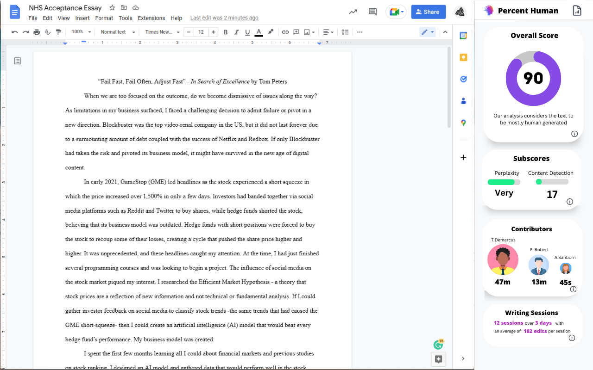
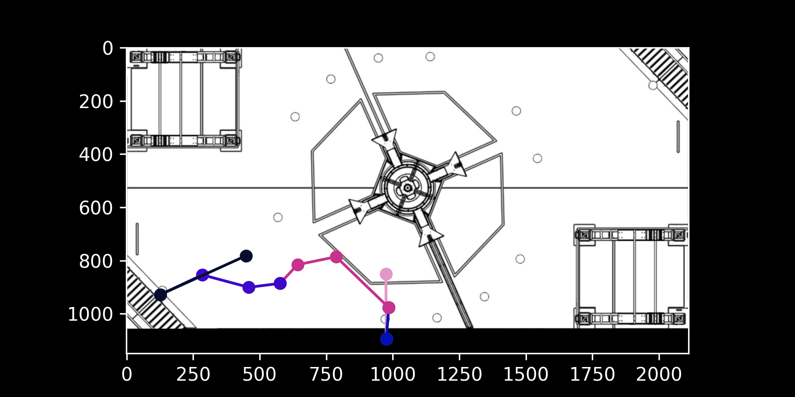
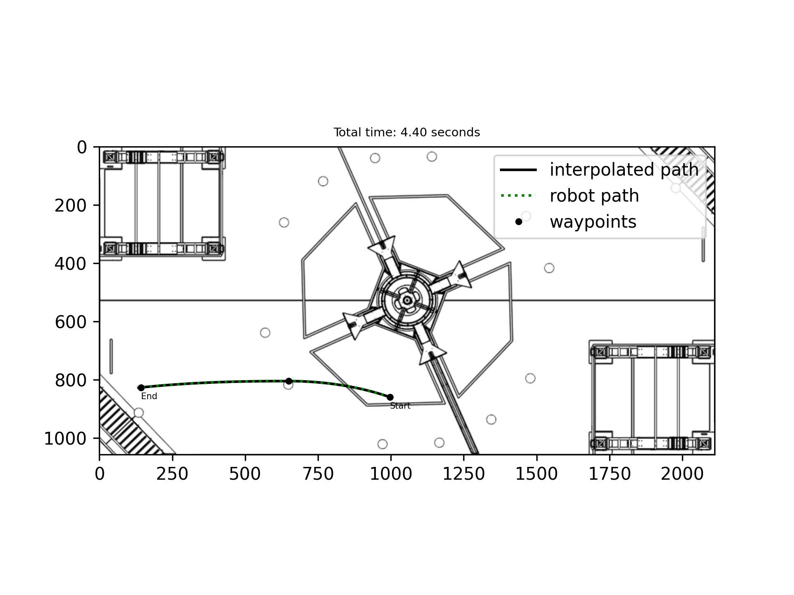
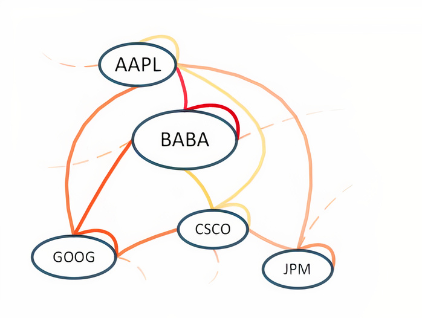
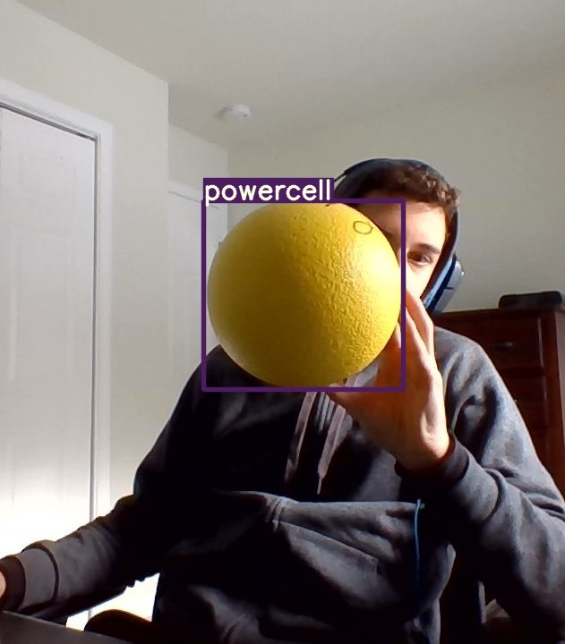

# Portfolio

I've included a variety of my coding projects in this repository. I've also included some Percent Human code including the Google Docs sidebar that Edward wanted to see.

These projects highlight my skills in Python, Javascript, React, data pipelines, and Machine Learning.

1. ### Percent Human Google Docs Sidebar

    
   
    This is a snippet from a React app that displays the Percent Human Google Docs sidebar. After reverse-engineering the Grammarly Chrome Extension, I was able to figure out how to use the built-in Google Docs sidebar to display my own Percent Human content. As of right now, I have a working code that displays the sidebar and can send data to the sidebar. I am currently working on the backend to send data from the Google Doc to the sidebar. I have a standalone implementation for edit history and Percent Human Scores but have yet to integrate it into the React code.

    Tech stack: JS, React, Chrome extension mv3

3. ### Path Planner and Trajectory Generator for FRC Robot

    Waypoints:
    

    This is a Python tool that creates a path for an FRC robot to follow. The user inputs waypoints on a scaled image of the FRC Game Field. It then uses piecewise cubic hermite interpolation splines to generate a smooth trajectory for the robot to follow. It also generates a velocity profile for the robot to follow at a 50Hz loop cycle. This project was used by my FRC team, 230 Gaelhawks, in the 2021-2022 season.

    Tech stack: **Numpy, Matplotlib**, Scipy, Pytest

    Sample interpolated path:
    

4. ### Graph Attention Networks for Relational Stock Ranking with Sentiment and Technical Analysis

    

   I used a Graph Attention Network to rank stocks based on their sentiment and technical analysis in an effort to outperform the S&P 500. I used the Yahoo Finance API to get stock data and the Twitter/Social Sentiment API to get sentiment data. To generate the GAT edge weights, I scraped data from Wikipedia about intercompany relationships such as shared C-level executives, board members, and partnerships. I used the Pytorch Geometric library to create the Graph Attention Network. I originally implemented the model in vanilla Pytorch but then used the Pytorch Lightning library to train the model.

    I created a data pipeline with over 2,000 stocks across the Nasdaq and NYSE for the past 3 years. I used the data to train the model and then tested the model on the S&P 500. [The model was able to outperform the S&P 500 by 10% in 2021.](gat_rsr_stock_ranking/Performance_Report.pdf) I also created a web app using Django to display the results of the model.
    

    I have included a few ML snippets. Lmk if you want my research and data pipeline code.

    Tech stack: **Pytorch, Numpy, Matplotlib, Scipy**, Pytorch Lightning, Pytorch Geometric, Django

6. ### Google Classroom to Todoist Sync

    This is a Python script that syncs Google Classroom assignments to the Todoist to-do list. It uses the Google Classroom OAuth API and the Todoist API. It is currently in use by a few students at my school. This project is hosted on Heroku and runs every 2 minutes. The backend is supported by a Postgres db also hosted on Heroku.

    Tech stack: SQL, Postgres, SQLAlchem, Heroku, OAuth

7. ### Realtime Object Detection and Pose Estimation for FRC Robot

    I create a machine learning pipeline to track yellow balls, called powercells, and various colored markers for an FRC robot. I created a dataset of these images and used Roboflow to annotate and draw bounding boxes for each. I was then able to train a YOLOv5 model to detect them. This model needed to be deployed on a Raspberry Pi that was mounted on the robot. This project primarily consisted of optimizing the model for performance while preserving accuracy. The location of the powercells and markers were sent to the robot's onboard computer to be used for path planning and trajectory generation.
   
    

    There were also Apriltags, big QR codes, that the robot could detect and use for knowing its location on the field. I created my own matrix library in C++ to perform the coordinate translations so that the robot could use the Apriltags to localize itself on the field. I converted the Euler angles from the camera to a direction cosine matrix and then to the robot frame. I then used the robot frame coordinates to generate a trajectory to a set position.
